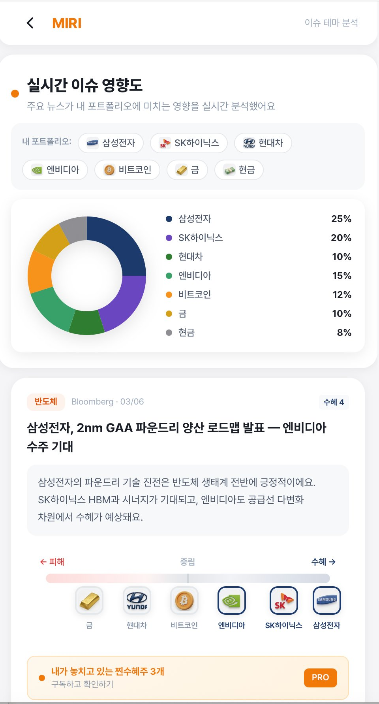
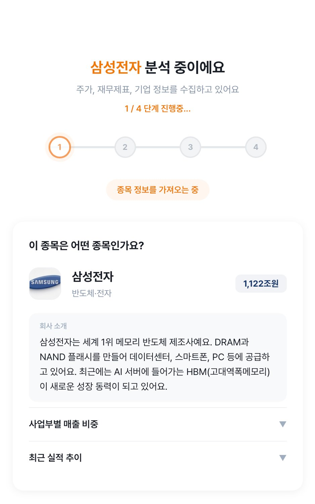

# 🔍 MIRI AI Research

**내 종목에 딱 필요한 이슈만, AI 비서 MIRI가 정리해드려요**

쏟아지는 뉴스·지표·실적 속에서 **내 종목에 실제로 영향 있는 정보만** 골라내고, 
쉬운 말로 정리해주는 AI 리서치 서비스입니다.

 

> **⚠️ 면책 고지 (Disclaimer)**
>
> 본 프로젝트는 **개인 포트폴리오 목적의 서비스 아이디어 데모**이며, 미래에셋증권(Mirae Asset Securities)과 어떠한 제휴·협력·고용 관계도 없습니다. 미래에셋증권의 공식 서비스, 제품, 또는 승인된 프로젝트가 **아닙니다**.
>
> 화면에 표시되는 종목명, 수치, 차트 등 모든 데이터는 **정적으로 생성된 가상의 더미 데이터**이며, 실제 시세·재무제표·기업 분석 결과를 반영하지 않습니다. **어떠한 투자 판단의 근거로도 사용할 수 없으며**, 본 데모를 참고하여 발생한 투자 손실 등에 대해 제작자는 일체의 책임을 지지 않습니다.

 

---

 

## 📊 이슈 테마 분석 — Issue Impact Analysis

하나의 뉴스/이슈가 **포트폴리오 전체**에 미치는 영향을 실시간 분석합니다.

- 수평 영향도 게이지로 자산별 수혜/피해를 직관적으로 시각화
- 자산별 영향도 점수 (-100 ~ +100) 정량화 + 구체적 사유 제시
- **찐수혜주 발굴** — 내가 놓치고 있는 숨겨진 수혜 종목 AI 추천 (프리미엄)

 

---

 

## 📈 단일 종목 분석 — AI Research Report

종목을 입력하면 **8가지 관점**의 종합 리포트를 생성합니다.

> 한줄요약 · 주가차트 · 회사소개 · 뉴스영향도 · 섹터비교 · 종합시나리오 · 밸류에이션 · AI종합판단

 

---

 

## 🤖 포트폴리오 전략 Agent — *Coming Soon*

유동성 · 재무 · 테마 3축 기반으로 **포트폴리오 구성 Agent**와 **위험 헷지 Agent**가 협업하여 최적 포트폴리오를 자동 구성합니다.

 

---

 

## 📄 Copyright Notice

© 2024–2026 Geonwoo Jo. All Rights Reserved.

This repository is made publicly available solely for portfolio demonstration purposes and is not open source.

Except as expressly permitted by applicable law and by GitHub’s technical and service-related rules for public repositories, no part of this repository, including without limitation its source code, documentation, images, visual assets, UI/UX elements, and other contents, may be copied, modified, distributed, publicly transmitted, used to create derivative works, used for commercial purposes, or used for AI/ML training or dataset construction, without the prior written consent of the copyright holder.

License inquiries: dlsrhddyd999@gmail.com
